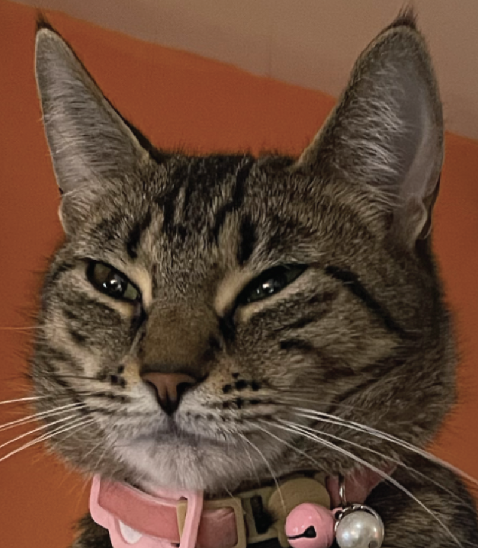

<picture>
 <source media="(prefers-color-scheme: dark)" srcset="https://github.com/classymagpie/classymagpie/blob/main/TailTip_Darkmode.png">
 <source media="(prefers-color-scheme: light)" srcset="https://github.com/classymagpie/classymagpie/blob/main/TailTip_LightMode.png">
 
</picture>

## About me in the context of coding

Hi, I'm Porfirio, and this is my GitHub page. I recently defended my Ph.D. dissertation and am transitioning to the job hunt as I concurrently finish my first-author manuscript 🪱. I have experience using shell/bash scripts to process genomic data through a high-performance cluster (HPC) at my home institution. However, I am still new to GitHub, so I'm here to figure out how things work (getting out of my comfort zone by trying different things). I've uploaded some scripts concerning bioinformatics I used for my thesis work (see DMD-3CHIPSEQ repo). I'm interested in learning more about coding in a general sense and hope to eventually practice novice web-based development. I am creating an "About me" _readme.md_ page to get in some practice and get my feet wet. I hope you like this funky Frankenstein-esk page and get to know me a little along the way. I'm open to collaborative projects and learning more. Please feel free to contact me. 

🔭 In the table below are the languages im dibbling and dabbling with, little by little. As a bonus, you can find a photograph of my sidekick on the right side 🐈, she's so motivational! 

<table>
<tr>
<td valign="top">

🌱 I’m currently learning ...

| Rank | Languages |
|-----:|-----------| 
|     1| Bash      |
|     2| R         |
|     3| Python    |
|     4| HTML      |          
|     5| SQL       |
|     6| Perl      |
|     7| MATLAB    |
|     8| Java      |
|     9| C++       |

 

</td>
<td align="center">
  

  
    
  <blockquote>
    
There's a one-degree difference between hot water and steam; TURN IT UP A LITTLE BIT!

    
— eRok the American Shorthair Tabby

  </blockquote>
</td>

<!-- TO DO: add more details about me later -->
<!--
**classymagpie/classymagpie** is a ✨ _special_ ✨ repository because its `README.md` (this file) appears on your GitHub profile.

Here are some ideas to get you started:

- 🔭 I’m currently working on ...
- 🌱 I’m currently learning ...
- 👯 I’m looking to collaborate on ...
- 🤔 I’m looking for help with ...
- 💬 Ask me about ...
- 📫 How to reach me: ...
- 😄 Pronouns: ...
- ⚡ Fun fact: ...
-->
